# Terraform Secure VPC + EC2

This project demonstrates the design and security hardening of a 3-tier AWS VPC and EC2 environment with Terraform.

- Build a **secure VPC architecture** with public and private subnets
- Enforce **least-privilege networking** (egress-only SG, no public IPs)
- Configure **SSM Session Manager** for bastionless access
- Apply **security best practices**: IMDSv2 required, EBS encryption, NAT for controlled outbound
- Map technical controls to **ISO/IEC 27001 Annex A**


##  What This Project Proves

Demonstrates my ability to design, codify, and validate **secure AWS infrastructure using Infrastructure as Code (IaC)**

- **Step 1:** VPC + Public EC2 (restricted SSH + demo HTTP ingress)
- **Step 2:** Private EC2 with **SSM-only access**, no SSH, no public IP
- **Step 3:** Endpoints, logging, encryption ((no NAT, full visibility))
- Clear **screenshots evidence** in `/docs/screenshots`
- **ISO 27001 mapping** included in README

<br>

> **Note:** This is **Step 1 &2** of a multi-step project.  
> The goal here is to establish the basic AWS networking foundation with a public VPC and EC2 instance.  
> This foundation will be expanded into:
> - **Step 2:** A secure private VPC with EC2 in private subnets, accessed via Session Manager, with VPC Endpoints for SSM, logging, and S3 — no NAT required.
> - **Step 3:** A production-grade secure baseline including KMS-encrypted VPC Flow Logs, remote state backend, security/compliance mapping, and CI/CD validation.

<br>

##  What This Project Creates
- **VPC** with DNS hostnames and DNS support enabled
- **Internet Gateway (IGW)**
- **Two public subnets** across different Availability Zones (using `for_each`)
  - `map_public_ip_on_launch = true`
- **Public route table** with a default route to the IGW
- **Route table associations** from each public subnet to the public route table
- **EC2 instance** launched in one of the public subnets
- **Security Group** with rules defined in the compute module

<br>

##  Project Structure

```plaintext
terraform-secure-vpc-ec2/
├── providers.tf
├── variables.tf
├── outputs.tf
├── main.tf                  # calls modules
├── modules/
│   ├── network/
│   │   ├── main.tf          # VPC, IGW, public subnets, route table, associations
│   │   ├── variables.tf
│   │   └── outputs.tf
│   └── compute/
│       ├── main.tf          # EC2 + Security Group
│       ├── variables.tf
│       └── outputs.tf
└── docs/
    └── screenshots/
        ├── vpc-overview.png
        ├── igw.png
        ├── subnets-public.png
        ├── rtb-public.png
        ├── rtb-associations.png
        ├── ec2-public-details.png
        ├── sg-rules.png
        └── terraform-output.png
```

<br>

## How to Run
```bash
terraform init
terraform plan
terraform apply
```

<br>

## Screenshots

| Step | Screenshot |
|------|------------|
| ✅ VPC Created | 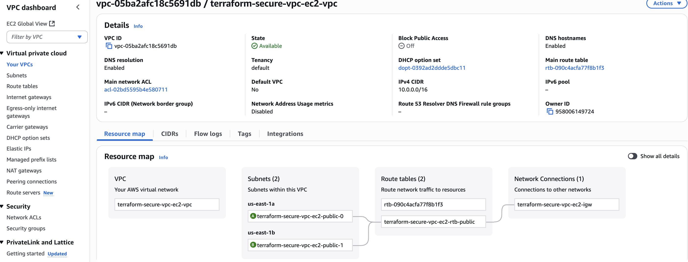 |
| ✅ Internet Gateway Attached | 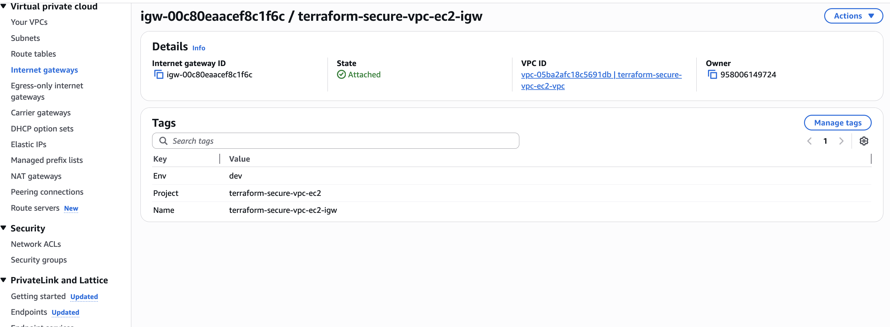 |
| ✅ Public Subnets Created | 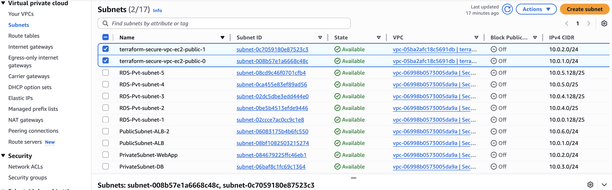 |
| ✅ Public Route Table with IGW Route | 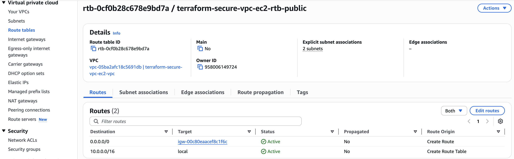 |
| ✅ Public Route Table Associations | 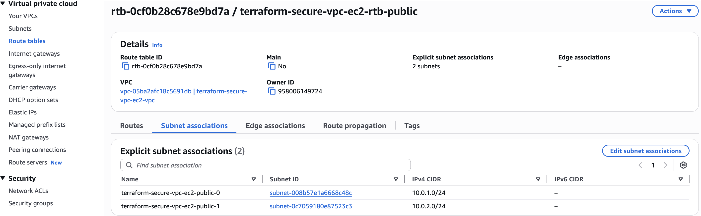 |
| ✅ EC2 in Public Subnet (Launch Config) | 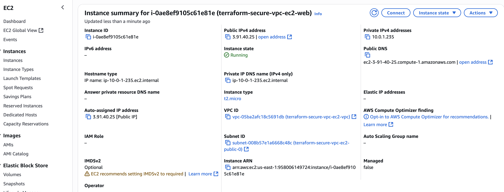 |
| ✅ Security Group Rules | 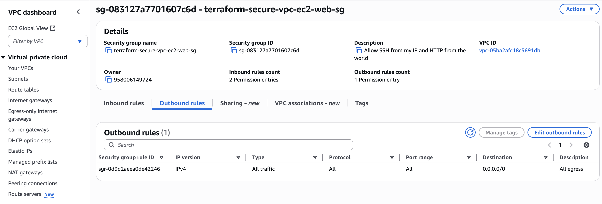 |
| ✅ Terraform Apply Output | 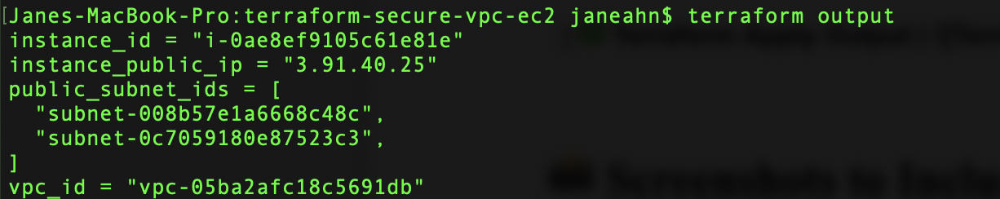 |

<br>
<br>

# Terraform Secure VPC + EC2 — Step 2 (Private EC2 via SSM)

---

## Project Description

This step extends the baseline VPC (Step 1) by adding a **private application tier**.  
The design ensures the EC2 instance is **not exposed to the internet** and is managed securely via **AWS Systems Manager Session Manager**.

---

## What This Project Proves:

✅ I can design and codify a **bastionless architecture** using Terraform  
✅ I enforce **least-privilege networking** (egress-only, no inbound)  
✅ I apply **security best practices**: IMDSv2, EBS encryption, IAM roles, SSM access  
✅ I map controls to **ISO/IEC 27001 Annex A** for compliance readiness  

---

##  Project Structure (Step 2)

```plaintext
terraform-secure-vpc-ec2/
├── providers.tf
├── variables.tf
├── outputs.tf
├── main.tf
├── modules/
│   ├── network/
│   │   ├── main.tf              # VPC, IGW, public subnets, public route table
│   │   ├── private.tf           # ✅ Private subnets, NAT Gateway, private route table
│   │   ├── variables.tf
│   │   ├── outputs.tf
│   │   └── locals.tf
│   └── compute/
│       ├── main.tf              # Public EC2 (Step 1, optional)
│       ├── private.tf           # ✅ Private EC2 (SSM only, no public IP, IMDSv2, encrypted EBS)
│       ├── variables.tf
│       └── outputs.tf
└── docs/
    └── screenshots/
        └── step2/
            ├── subnets-private.png
            ├── nat-eip.png
            ├── nat-gateway.png
            ├── rtb-private.png
            ├── rtb-private-associations.png
            ├── ec2-private-details.png
            ├── ssm-managed.png
            ├── ssm-session.png
            └── terraform-output.png


```

<br>

## How to Run
```bash
terraform init
terraform plan
terraform apply
```
<br> 

## Screenshots (Step 2)

| Step | Screenshot |
|------|------------|
| ✅ Private Subnets Created | 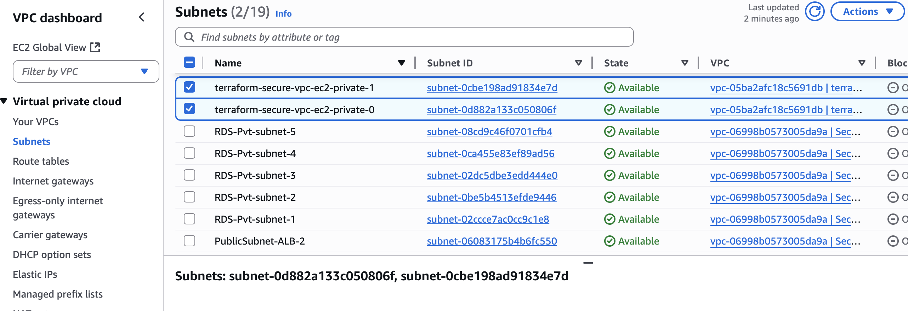 |
| ✅ NAT EIP Allocated | 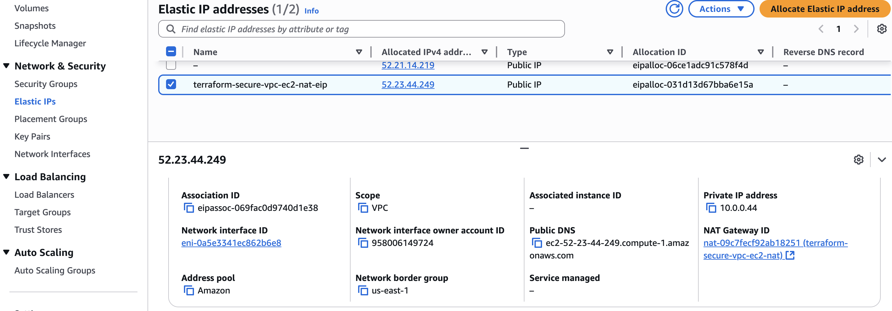 |
| ✅ NAT Gateway Available | 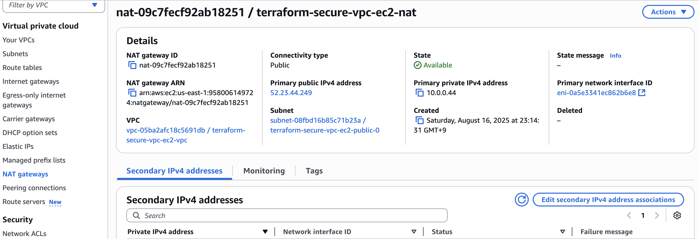 |
| ✅ Private Route Table with NAT Route | 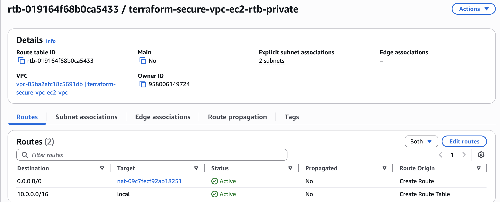 |
| ✅ Private Route Table Associations | 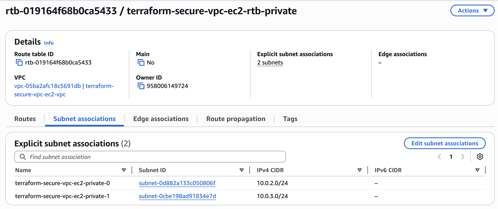 |
| ✅ EC2 in Private Subnet (No Public IP, SSM Role) | 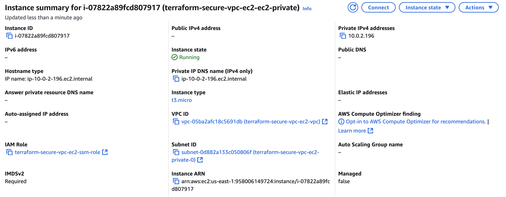 |
| ✅ SSM Managed Instance | 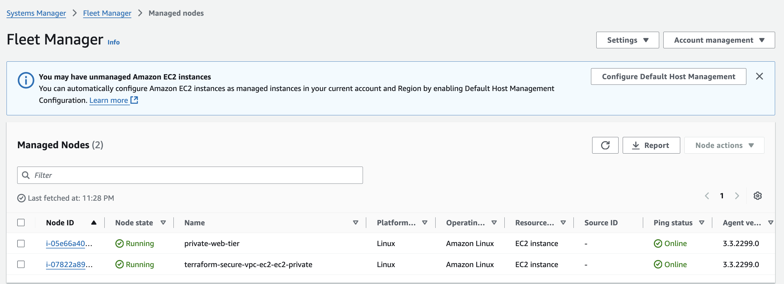 |
| ✅ SSM Session Active | 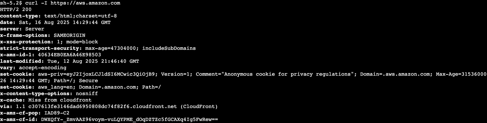 |
| ✅ Terraform Apply Output | 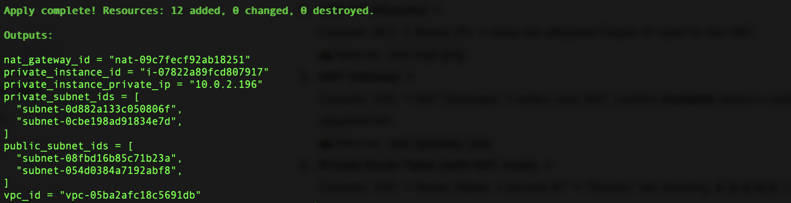 |


---

## Security Highlights

- **No inbound exposure** → EC2 has no public IP, no SSH  
- **Bastionless access** → Managed exclusively through AWS Systems Manager Session Manager  
- **Egress-only SG** → Outbound ports 80/443 only (updates + SSM traffic)  
- **IMDSv2 enforced** → Protects against SSRF credential theft  
- **Encrypted EBS volumes** → Data at rest protected by default  
- **IAM role with SSM policy** → Principle of least privilege for instance management  

---

## ISO/IEC 27001 Annex A Mapping

- **A.8.20 Use of cryptography** → Encrypted EBS volumes  
- **A.8.28 Secure authentication** → IMDSv2 required  
- **A.8.24 Data leakage prevention** → No public IP, egress-only networking  
- **A.5.23 Cloud security** → Private subnets, bastionless access via SSM  
- **A.8.16 Identity & access control** → Scoped IAM role for SSM access  

