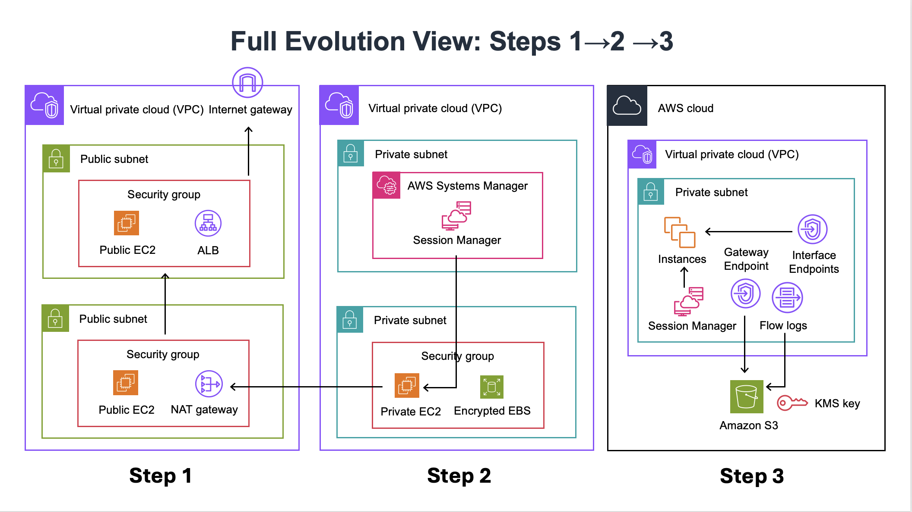
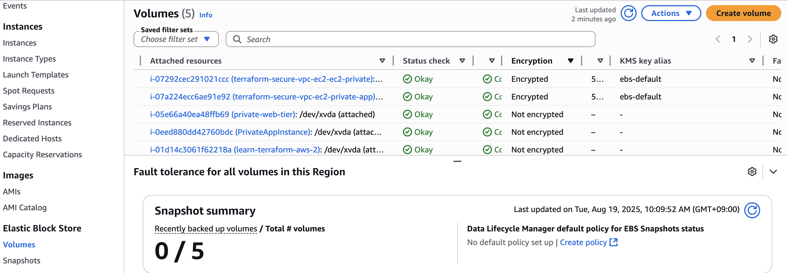
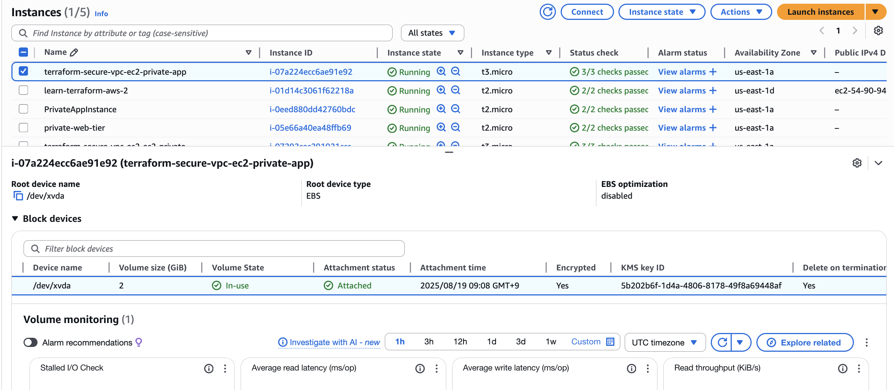
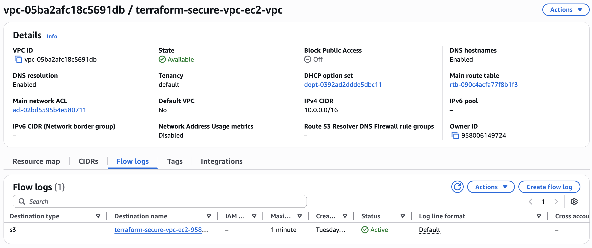
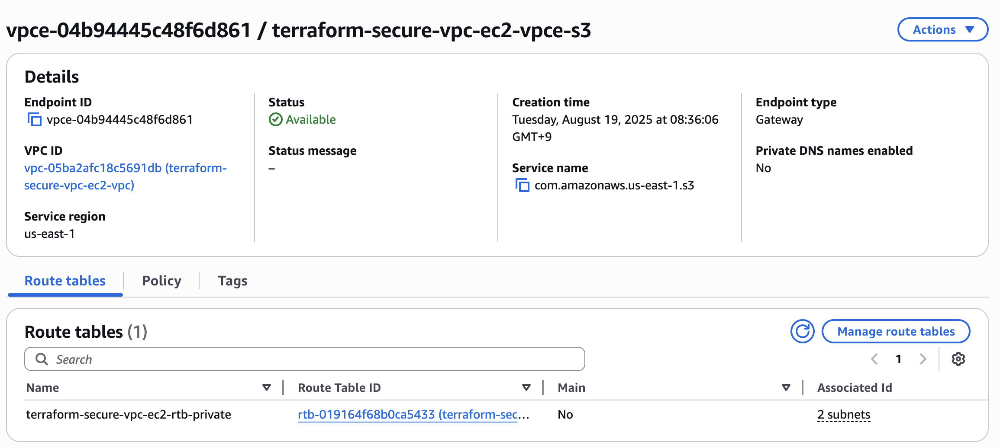
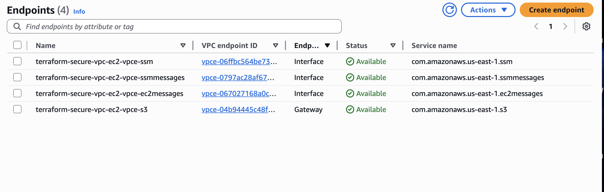
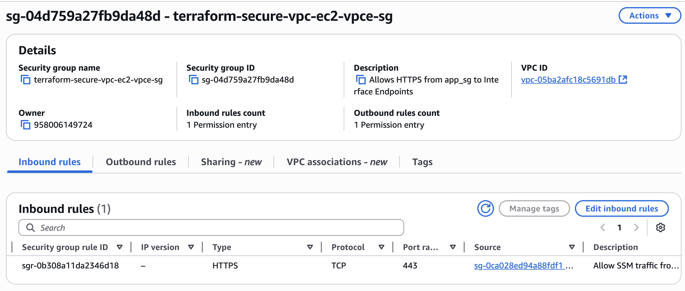
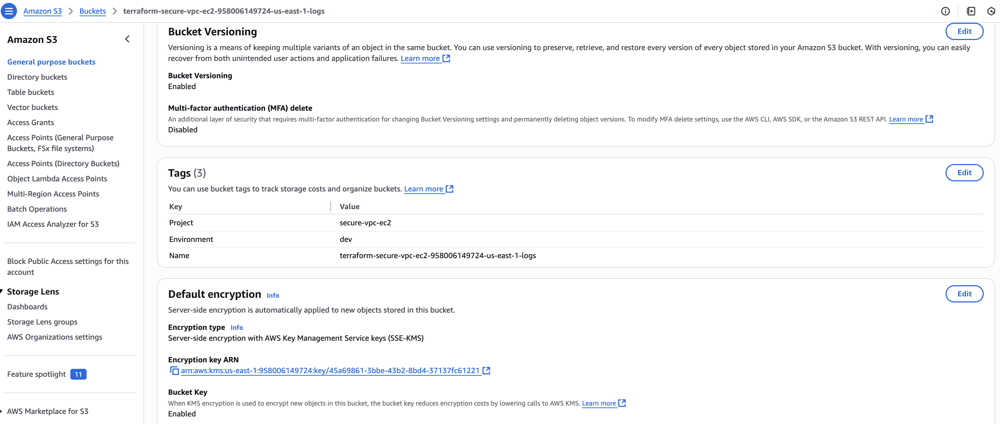

# 🌐 Terraform Secure VPC + EC2 — Portfolio Project  


## 📘 Overview  
This portfolio demonstrates how to **design, harden, and document secure AWS workloads** using Terraform.  
It evolves across **three steps**, each adding stronger security and compliance layers:  

1. **Step 1 — Public EC2 + ALB**  
   - Basic VPC, Internet Gateway, Security Groups  
   - Application Load Balancer + Public EC2  

2. **Step 2 — Private EC2 (SSM only)**  
   - Private Subnets + NAT Gateway  
   - Private EC2 (no public IP) managed via **Session Manager**  
   - Encrypted EBS volumes + IMDSv2 enforced  

3. **Step 3 — Centralized Logging + VPC Endpoints**  
   - Default EBS encryption enabled  
   - VPC Flow Logs → S3 with SSE-KMS (CMK protected)  
   - VPC Endpoints for SSM, EC2 Messages, and S3  
   - Scoped Security Groups for least privilege  

---

##  What This Portfolio Demonstrates  
- Secure AWS infrastructure **codified with Terraform**  
- Application of **security best practices**: encryption, least privilege, bastionless access  
- Mapping of technical design to **ISO/IEC 27001 Annex A controls**  
- **Evidence-based documentation**: screenshots + Terraform code  


---

##  ISO/IEC 27001 Annex A Coverage  

| Step | Controls Implemented |
|------|-----------------------|
| **Step 1** | A.8.24 Data leakage prevention (SG rules)<br>A.5.23 Cloud security (subnet segregation) |
| **Step 2** | A.8.20 Use of cryptography (EBS encryption)<br>A.8.28 Secure authentication (IMDSv2)<br>A.8.16 Identity & access control (IAM role for SSM)<br>A.8.24 Data leakage prevention (no public IP)<br>A.5.23 Cloud security (bastionless via SSM) |
| **Step 3** | A.12.4 Logging & monitoring (Flow Logs to S3)<br>A.8.20 Use of cryptography (SSE-KMS, CMK)<br>A.8.24 Data leakage prevention (VPC endpoints)<br>A.5.23 Cloud security (private-only + audit trail)<br>A.8.16 Identity & access control (SSM least privilege) |

📄 Full mappings: [`docs/iso27001-mapping.md`](docs/iso27001-mapping.md)  


<br>


## 🖼️ Architecture Diagram  
  


<br>

## Project Structure  

```bash
terraform-secure-vpc-ec2/
├── providers.tf
├── variables.tf
├── outputs.tf
├── main.tf
├── modules/
│   ├── compute/
│   │   ├── main.tf                # Step 1 - Public EC2
│   │   ├── private.tf             # Step 2 - Private EC2
│   │   ├── step3_encryption.tf    # Step 3 - Encrypted EBS
│   │   ├── outputs.tf
│   │   └── variables.tf
│   └── network/
│       ├── main.tf                # Step 1 - VPC, IGW
│       ├── private.tf             # Step 2 - Private subnets + NAT
│       ├── step3_endpoints+logging.tf  # Step 3 - Endpoints + Flow Logs
│       ├── locals.tf
│       ├── outputs.tf
│       └── variables.tf
└── docs/
    ├── diagrams/
    │   └── architecture-diagram.png
    ├── iso27001-mapping.md
    └── screenshots/
        ├── step1/
        ├── step2/
        └── step3/

```

## How to Run
```bash
terraform init
terraform plan
terraform apply
```
<br>
<br>
<br>

---

# 📘 **Step 1**  

# Terraform Secure VPC + EC2 — Step 1 (Public EC2 + ALB)

## Project Description  
This step builds the **foundation VPC** with public subnets, an Internet Gateway, and a demo EC2 instance behind an ALB.  
It establishes the base networking layer to be secured and extended in later steps.  

---

## What This Step Proves  
- I can codify a **basic VPC architecture** with Terraform  
- I can configure **Internet Gateway, routing, and public subnets**  
- I can launch a **public EC2 instance behind an ALB**  
- I can apply **initial ISO/IEC 27001 Annex A mappings**  

---

## Project Structure (Step 1)  

```bash
terraform-secure-vpc-ec2/
├── main.tf
├── providers.tf
├── variables.tf
├── outputs.tf
├── modules/
│   ├── network/
│   │   ├── main.tf          # VPC, IGW, public subnets, public route table
│   │   ├── variables.tf
│   │   └── outputs.tf
│   └── compute/
│       ├── main.tf          # Public EC2 + Security Group
│       ├── variables.tf
│       └── outputs.tf
└── docs/screenshots/step1/
```


## Screenshots

| Step | Screenshot |
|------|------------|
| ✅ VPC Created |  |
| ✅ Internet Gateway Attached |  |
| ✅ Public Subnets Created |  |
| ✅ Public Route Table with IGW Route |  |
| ✅ Public Route Table Associations |  |
| ✅ EC2 in Public Subnet (Launch Config) |  |
| ✅ Security Group Rules |  |
| ✅ Terraform Apply Output |  |


---

## Security Highlights
- **Basic segregation of subnets** → Public vs private  
- **Security Groups** → Limit inbound traffic  
- **Foundation** → Compliance-ready design  

---

## ISO/IEC 27001 Annex A Mapping
- **A.8.24 Data leakage prevention** → Security Group rules  
- **A.5.23 Cloud security** → Segregated subnet design  

---

# 📘 **Step 2**  

# Terraform Secure VPC + EC2 — Step 2 (Private EC2 via SSM)

---

## Project Description

This step extends the baseline VPC (Step 1) by adding a **private application tier**.  
The design ensures the EC2 instance is **not exposed to the internet** and is managed securely via **AWS Systems Manager Session Manager**.

---

## What This Project Proves:

✅ I can design and codify a **bastionless architecture** using Terraform  
✅ I enforce **least-privilege networking** (egress-only, no inbound)  
✅ I apply **security best practices**: IMDSv2, EBS encryption, IAM roles, SSM access  
✅ I map controls to **ISO/IEC 27001 Annex A** for compliance readiness  

---

##  Project Structure (Step 2)

```bash
terraform-secure-vpc-ec2/
├── main.tf
├── modules/
│   ├── network/
│   │   ├── private.tf           # Private subnets + NAT Gateway
│   └── compute/
│       ├── private.tf           # Private EC2 (SSM only, IMDSv2, encrypted EBS)
└── docs/screenshots/step2/

```

## Screenshots (Step 2)

| Step | Screenshot |
|------|------------|
| ✅ Private Subnets Created |  |
| ✅ NAT EIP Allocated |  |
| ✅ NAT Gateway Available |  |
| ✅ Private Route Table with NAT Route |  |
| ✅ Private Route Table Associations |  |
| ✅ EC2 in Private Subnet (No Public IP, SSM Role) |  |
| ✅ SSM Managed Instance |  |
| ✅ SSM Session Active |  |
| ✅ Terraform Apply Output |  |


---

## Security Highlights

- **No inbound exposure** → EC2 has no public IP, no SSH  
- **Bastionless access** → Managed exclusively through AWS Systems Manager Session Manager  
- **Egress-only SG** → Outbound ports 80/443 only (updates + SSM traffic)  
- **IMDSv2 enforced** → Protects against SSRF credential theft  
- **Encrypted EBS volumes** → Data at rest protected by default  
- **IAM role with SSM policy** → Principle of least privilege for instance management  

---

## ISO/IEC 27001 Annex A Mapping

- **A.8.20 Use of cryptography** → Encrypted EBS volumes  
- **A.8.28 Secure authentication** → IMDSv2 required  
- **A.8.24 Data leakage prevention** → No public IP, egress-only networking  
- **A.5.23 Cloud security** → Private subnets, bastionless access via SSM  
- **A.8.16 Identity & access control** → Scoped IAM role for SSM access  


---

# 📘 **Step 3**  

# Terraform Secure VPC + EC2 — Step 3 (Centralized Logging & VPC Endpoints)

## Project Description  
This step enforces **centralized logging, encryption, and private connectivity**.  
It ensures auditability and compliance through VPC Flow Logs, KMS protection, and private VPC Endpoints.  

---

## What This Step Proves  
- I can enforce **encryption at rest & in transit**  
- I can design **centralized logging** with KMS protection  
- I can configure **VPC Endpoints** for private-only traffic  
- I can demonstrate **compliance mapping** with ISO/IEC 27001  

---

## Project Structure (Step 3)  

```bash
terraform-secure-vpc-ec2/
├── modules/
│   ├── compute/
│   │   ├── step3_encryption.tf      # Encrypted EBS volumes
│   └── network/
│       ├── step3_endpoints+logging.tf  # VPC Endpoints + Flow Logs
└── docs/screenshots/step3/

```
---

## Screenshots (Step 3)

| Step | Screenshot |
|------|------------|
| ✅ Default EBS Encryption Enabled |  |
| ✅ EC2 Root Volume Encrypted |  |
| ✅ KMS CMK Created for Logs |  |
| ✅ VPC Flow Logs Active |  |
| ✅ VPC Endpoint (Gateway for S3) |  |
| ✅ VPC Endpoints (SSM, EC2 Messages) |  |
| ✅ Security Group Scoped to HTTPS |  |
| ✅ Logs S3 Bucket with SSE-KMS |  |
| ✅ Flow Logs Delivered to S3 |  |

---

## Security Highlights
- **EBS encryption** → Default + CMK for compliance  
- **Centralized logging** → Flow Logs → S3 (SSE-KMS)  
- **Private connectivity** → SSM & S3 endpoints, no internet traversal  
- **Scoped Security Group** → Only HTTPS traffic allowed  
- **Bastionless management** → EC2 via SSM only  

---

## ISO/IEC 27001 Annex A Mapping
- **A.8.24 Use of cryptography** → EBS default encryption, SSE-KMS for logs  
- **A.8.15 Logging** → VPC Flow Logs capture all traffic events  
- **A.8.16 Monitoring activities** → Logs delivered to encrypted S3 bucket with restricted access policy  
- **A.8.12 Data leakage prevention** → VPC Endpoints restrict traffic paths  
- **A.5.23 Information security for use of cloud services** → Private-only design with centralized audit trail  
- **A.8.16 Identity & access control** → IAM role for SSM (least privilege)  
- **A.8.28 Secure authentication** → IMDSv2 enforced  


<br>
