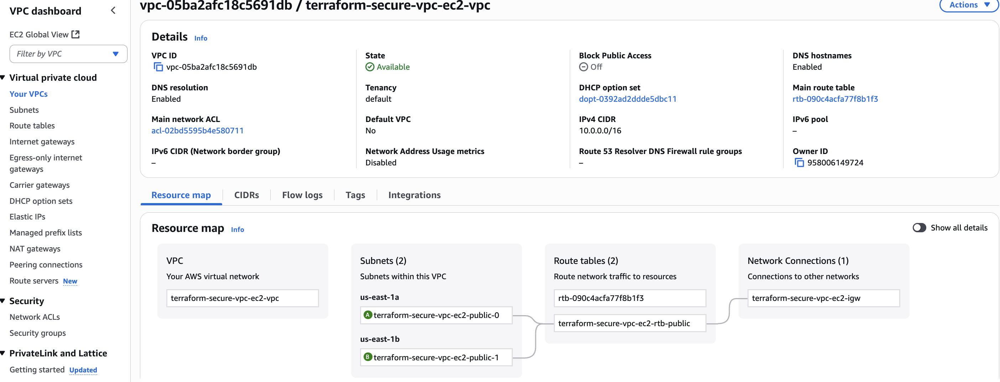
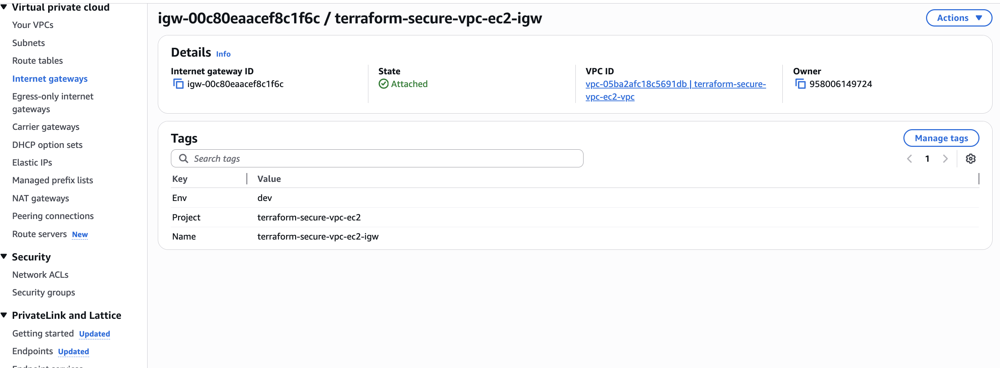
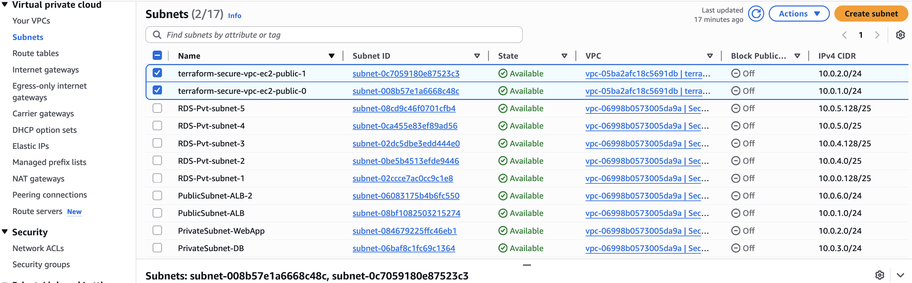
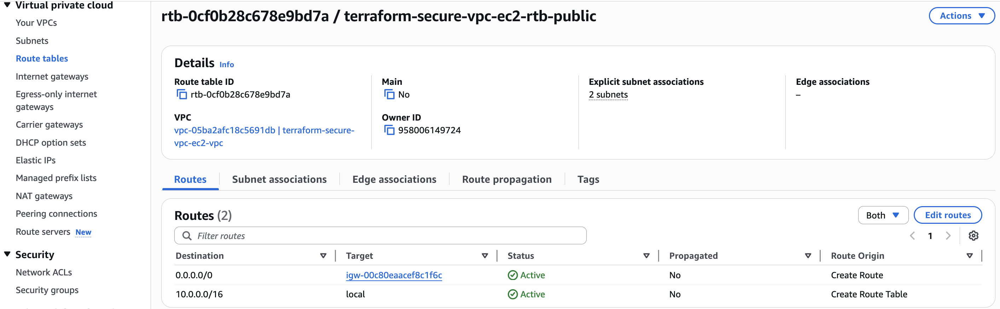
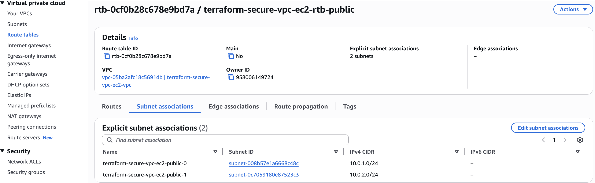
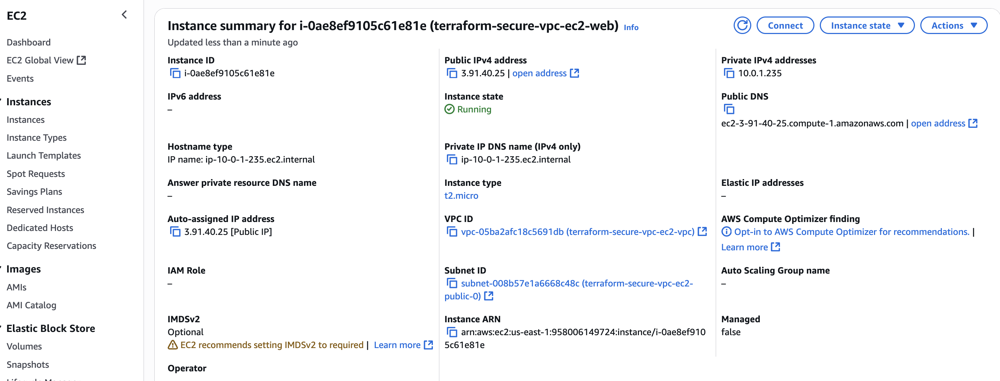
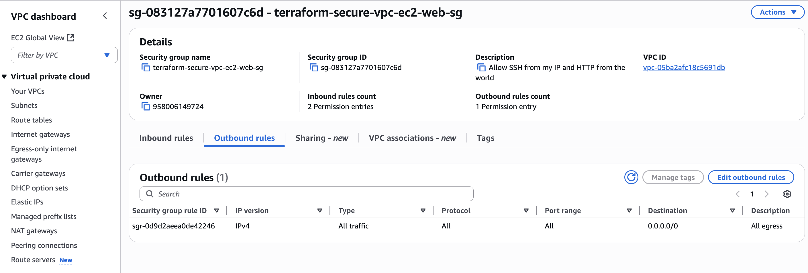
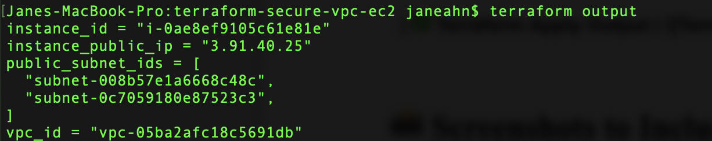

# Terraform Mini Project — Public VPC + EC2 (Foundation for Secure VPC Build)

> **Note:** This is **Step 1** of a multi-step project.  
> The goal here is to establish the basic AWS networking foundation with a public VPC and EC2 instance.  
> This foundation will be expanded into:
> - **Step 2:** A secure private VPC with EC2 in private subnets, accessed via Session Manager, with VPC Endpoints for SSM, logging, and S3 — no NAT required.
> - **Step 3:** A production-grade secure baseline including KMS-encrypted VPC Flow Logs, remote state backend, security/compliance mapping, and CI/CD validation.


---


##  What This Project Creates
- **VPC** with DNS hostnames and DNS support enabled
- **Internet Gateway (IGW)**
- **Two public subnets** across different Availability Zones (using `for_each`)
  - `map_public_ip_on_launch = true`
- **Public route table** with a default route to the IGW
- **Route table associations** from each public subnet to the public route table
- **EC2 instance** launched in one of the public subnets
- **Security Group** with rules defined in the compute module


---


##  Project Structure

terraform-secure-vpc-ec2/
├── providers.tf
├── variables.tf
├── outputs.tf
├── main.tf                 # calls modules
├── modules/
│   ├── network/
│   │   ├── main.tf         # VPC, IGW, public subnets, route table, associations
│   │   ├── variables.tf
│   │   └── outputs.tf
│   └── compute/
│       ├── main.tf         # EC2 + Security Group
│       ├── variables.tf
│       └── outputs.tf
└── docs/
    └── screenshots/
        ├── vpc-overview.png
        ├── igw.png
        ├── subnets-public.png
        ├── rtb-public.png
        ├── rtb-associations.png
        ├── ec2-public-details.png
        ├── sg-rules.png
        └── terraform-output.png


---

## How to Run
```bash
terraform init
terraform plan
terraform apply
```

---

## Screenshots

| Step | Screenshot |
|------|------------|
| ✅ VPC Created |  |
| ✅ Internet Gateway Attached |  |
| ✅ Public Subnets Created |  |
| ✅ Public Route Table with IGW Route |  |
| ✅ Public Route Table Associations |  |
| ✅ EC2 in Public Subnet (Launch Config) |  |
| ✅ Security Group Rules |  |
| ✅ Terraform Apply Output |  |
